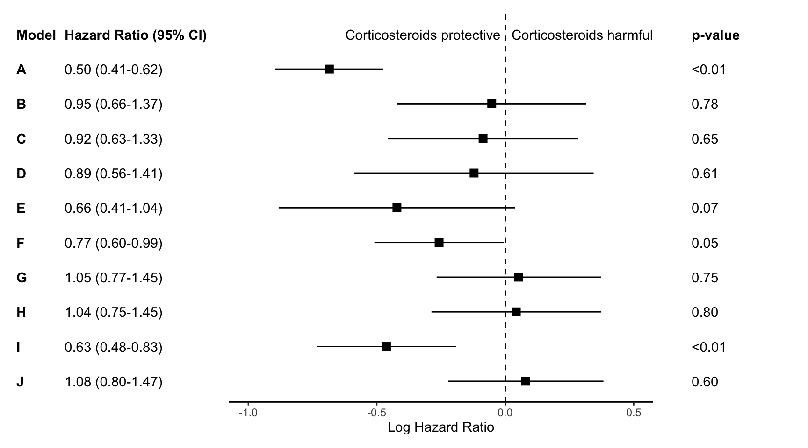

<md-block>

## Customizing forest plots in R

_Last updated: July 2024_

A customized forest plot in R.

---

### Tools & Skills

#### R programming ● meta-analysis ● statistical analysis ● forest plot

#### src code: [github.com/anascacais/forest-plot-SR](https://github.com/anascacais/forest-plot-SR)

---

### Why Forest Plots?

At the start of 2024, I had come up with the _(terrible)_ idea of doing a systematic review and meta-analysis of my PhD thesis topic: automated algorithms for seizure likelihood forecast. When researching how to perform a meta-analysis, I quickly identified three main requirements:

> - Calculating summary effect and confidence intervals;
> - Exploring sources of heterogeneity (modeled as covariates in the analysis), according to changes in I^2;
> - Visualizing overall and subgroup effect-size - this is where **forest plots come in**.

### Defining my Visualization Requirements

For visualization, I needed to achieve three things:

> - Overall and subgroup effect size, along with confidence intervals
> - Heterogeneity information
> - Characteristics of the studies, such as authors, publication year, and sample size.

### Materials and Methods

With my Python background, I immediately started looking Python libraries for meta-analysis, such as _statsmodels_. But, they seemed to be less well-established for these types of analyses (_statsmodels_ even states "the API is still experimental") - at least for now! So I decided to explore R.

R libraries like _metafor_ are pretty great in terms of functionality, but I found them confusing when it came to subgroup analysis and adding extra information to the forest plot (like study characteristics). Besides, I like things pretty - what can I say - so it’s important to me to be able to change colors and rearrange things, and those libraries just weren’t encouraging that “creative” side.

So, I started this journey on a [post by Katherine Hoffman](https://www.khstats.com/blog/forest-plots/), which proposed using _metafor_, _ggplot2_, and _patchwork_.

Start-up point of forest plot. src: https://www.khstats.com/blog/forest-plots/ 

